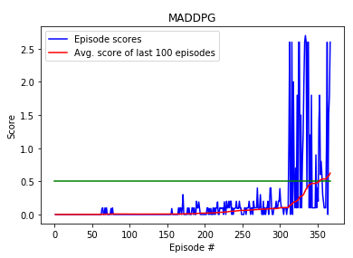

[//]: # (Image References)

[image1]: https://user-images.githubusercontent.com/10624937/42135623-e770e354-7d12-11e8-998d-29fc74429ca2.gif "Trained Agent"
[image2]: https://user-images.githubusercontent.com/10624937/42135622-e55fb586-7d12-11e8-8a54-3c31da15a90a.gif "Soccer"

# Project 3 : Collaboration-Competition
## Introduction:

For this project, we will work with the [Tennis](https://github.com/Unity-Technologies/ml-agents/blob/master/docs/Learning-Environment-Examples.md#tennis) environment and solve it using RLdeep learning based models for multi-agent continuous controls and actions, implementing MADDPG (Multi Agent Deep Deterministic Policy Gradient and the detail is in https://arxiv.org/pdf/1706.02275.pdf.)

![Trained Agent][image1]

In this environment, two agents control rackets to bounce a ball over a net. If an agent hits the ball over the net, it receives a reward of +0.1. If an agent lets a ball hit the ground or hits the ball out of bounds, it receives a reward of -0.01. Thus, the goal of each agent is to keep the ball in play.

The observation space consists of 8 variables corresponding to the position and velocity of the ball and racket. Each agent receives its own, local observation. Two continuous actions are available, corresponding to movement toward (or away from) the net, and jumping.

The task is episodic, and in order to solve the environment, your agents must get an average score of +0.5 (over 100 consecutive episodes, after taking the maximum over both agents). Specifically,

- After each episode, we add up the rewards that each agent received (without discounting), to get a score for each agent. This yields 2 (potentially different) scores. We then take the maximum of these 2 scores.
- This yields a single score for each episode.
The environment is considered solved, when the average (over 100 episodes) of those scores is at least +0.5.

## Setup Libraries

You will need to have `Python >= 3.5` and `pip` installed, plus some aditional libraries such as:

- matplotlib
- numpy>=1.11.0
- torch==0.4.0
- unityagents

Before continuing, it is recomended that you create a new [python virtualenv](https://virtualenv.pypa.io/en/latest/) before continuing. You can install the dependencies by cloning this repository and running the following  command lines on Linux (once you are in the desired virtualenv):

```sh
# Clone repo and move into installation directory
git clone https://github.com/ronrest/rlnd_p2
cd rlnd_p2/python

# install dependencies
pip install .

# Go back to root directory of repo
cd ../
```

## Getting Started:

1. The environment can be downloaded from one of the links below for all operating systems:
    - Linux: [click here](https://s3-us-west-1.amazonaws.com/udacity-drlnd/P3/Tennis/Tennis_Linux.zip)
    - Mac OSX: [click here](https://s3-us-west-1.amazonaws.com/udacity-drlnd/P3/Tennis/Tennis.app.zip)
    - Windows (32-bit): [click here](https://s3-us-west-1.amazonaws.com/udacity-drlnd/P3/Tennis/Tennis_Windows_x86.zip)
    - Windows (64-bit): [click here](https://s3-us-west-1.amazonaws.com/udacity-drlnd/P3/Tennis/Tennis_Windows_x86_64.zip)
    - _For AWS_: To train the agent on AWS (without [enabled virtual screen](https://github.com/Unity-Technologies/ml-agents/blob/master/docs/Training-on-Amazon-Web-Service.md)), use [this link](https://s3-us-west-1.amazonaws.com/udacity-drlnd/P3/Tennis/Tennis_Linux_NoVis.zip) to obtain the "headless" version of the environment.  The agent can **not** be watched without a virtual screen, but can be trained.  (_To watch the agent, one can follow the instructions to [enable a virtual screen](https://github.com/Unity-Technologies/ml-agents/blob/master/docs/Training-on-Amazon-Web-Service.md), and then download the environment for the **Linux** operating system above._)

2. Place the downloaded file in the same directory as this GitHub repository and unzip the file.

### Instructions
Follow the instructions in 'Tennis.ipynb' to get stated with training your own agent!


# Result

