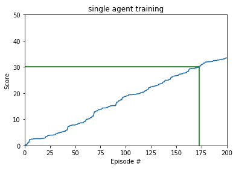
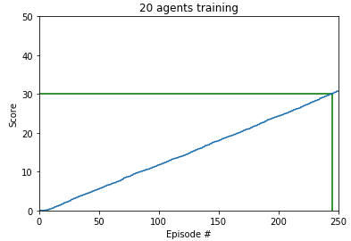

# Project 2 : Navigation

## Introduction:
This model is trained to place a doulbe-jointed arm to target loctations, implementing DDPG (Deep Deterministic Policy Gradient and the detail is in https://arxiv.org/abs/1509.02971.)

| Random agent             |  Trained agent |
:-------------------------:|:-------------------------:
  |  

In this environment, a double-jointed arm can move to target locations. A reward of +0.1 is provided for each step that the agent's hand is in the goal location. Thus, the goal of your agent is to maintain its position at the target location for as many time steps as possible.

The observation space consists of 33 variables corresponding to position, rotation, velocity, and angular velocities of the arm. Each action is a vector with four numbers, corresponding to torque applicable to two joints. Every entry in the action vector should be a number between -1 and 1.

There are two options: training a single agent and 20 agents.
The trained model in each case is denoted _1 (single agent) and _20 (20 agents).

## Setup Libraries

You will need to have `Python >= 3.5` and `pip` installed, plus some aditional libraries such as:

- matplotlib
- numpy>=1.11.0
- torch==0.4.0
- unityagents

Before continuing, it is recomended that you create a new [python virtualenv](https://virtualenv.pypa.io/en/latest/) before continuing. You can install the dependencies by cloning this repository and running the following  command lines on Linux (once you are in the desired virtualenv):

```sh
# Clone repo and move into installation directory
git clone https://github.com/ronrest/rlnd_p2
cd rlnd_p2/python

# install dependencies
pip install .

# Go back to root directory of repo
cd ../
```

## Getting Started:

1. Download the environment from one of the links below.  You need only select the environment that matches your operating system:

    - **_Version 1: One (1) Agent_**
        - Linux: [click here](https://s3-us-west-1.amazonaws.com/udacity-drlnd/P2/Reacher/one_agent/Reacher_Linux.zip)
        - Mac OSX: [click here](https://s3-us-west-1.amazonaws.com/udacity-drlnd/P2/Reacher/one_agent/Reacher.app.zip)
        - Windows (32-bit): [click here](https://s3-us-west-1.amazonaws.com/udacity-drlnd/P2/Reacher/one_agent/Reacher_Windows_x86.zip)
        - Windows (64-bit): [click here](https://s3-us-west-1.amazonaws.com/udacity-drlnd/P2/Reacher/one_agent/Reacher_Windows_x86_64.zip)

    - **_Version 2: Twenty (20) Agents_**
        - Linux: [click here](https://s3-us-west-1.amazonaws.com/udacity-drlnd/P2/Reacher/Reacher_Linux.zip)
        - Mac OSX: [click here](https://s3-us-west-1.amazonaws.com/udacity-drlnd/P2/Reacher/Reacher.app.zip)
        - Windows (32-bit): [click here](https://s3-us-west-1.amazonaws.com/udacity-drlnd/P2/Reacher/Reacher_Windows_x86.zip)
        - Windows (64-bit): [click here](https://s3-us-west-1.amazonaws.com/udacity-drlnd/P2/Reacher/Reacher_Windows_x86_64.zip)
    
    (_For Windows users_) Check out [this link](https://support.microsoft.com/en-us/help/827218/how-to-determine-whether-a-computer-is-running-a-32-bit-version-or-64) if you need help with determining if your computer is running a 32-bit version or 64-bit version of the Windows operating system.

    (_For AWS_) If you'd like to train the agent on AWS (and have not [enabled a virtual screen](https://github.com/Unity-Technologies/ml-agents/blob/master/docs/Training-on-Amazon-Web-Service.md)), then please use [this link](https://s3-us-west-1.amazonaws.com/udacity-drlnd/P2/Reacher/one_agent/Reacher_Linux_NoVis.zip) (version 1) or [this link](https://s3-us-west-1.amazonaws.com/udacity-drlnd/P2/Reacher/Reacher_Linux_NoVis.zip) (version 2) to obtain the "headless" version of the environment.  You will **not** be able to watch the agent without enabling a virtual screen, but you will be able to train the agent.  (_To watch the agent, you should follow the instructions to [enable a virtual screen](https://github.com/Unity-Technologies/ml-agents/blob/master/docs/Training-on-Amazon-Web-Service.md), and then download the environment for the **Linux** operating system above._)

2. Place the file in the DRLND GitHub repository, in the same folder, and unzip (or decompress) the file. 

### Instructions

Follow the instructions in `Continuous_Control_DDPG.ipynb` to get started with training your own agent!


# Result

| Trained single agent           |  Trained 20 agents |
:-------------------------:|:-------------------------:
  |  


