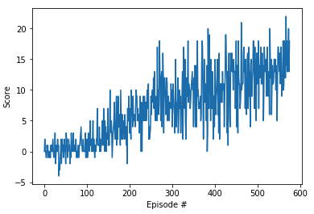

# Project 1 : Navigation

## Introduction:

This model is trained to navigate and collect 'yellow' bananas in a continuous space, implementing DDQN.

| Random agent             |  Trained agent |
:-------------------------:|:-------------------------:
  |  

The task is episodic.
The state space has 37 dimensions and contains the agent's velocity, along with ray-based perception of objects around the agent's forward direction, and the action space is discrete: move forward, move backward, turn left and turn right.

## Getting Started:
### Dependencies:
1. Python 3.6 and Jupyter
2. Pytorch

    https://pytorch.org/get-started/locally/
    
# Code Description

- 'model.py' : Q-Network Architecture
- 'Navigation.ipynb' : execution code, which contains Agent, ReplayBuffer and training.
- 'checkpoint.pth' : trained weights

# Run the code
Open and Execute all the lines in Navigation.ipynb in Jupyter

# Result

    The environment solved in 476 episodes and the average Score is 13.04.
